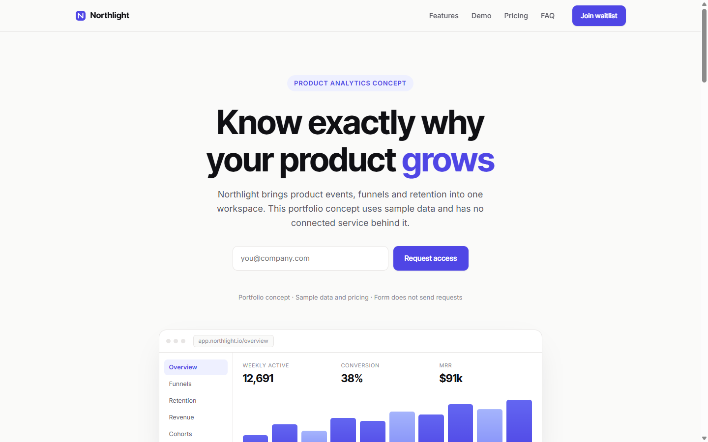

# Northlight — лендинг платформы продуктовой аналитики

Лендинг вымышленного SaaS-сервиса Northlight: аналитика продукта для команд. Концепт для портфолио (бренд zaxdev) — чистые HTML, CSS и JavaScript, без фреймворков и сборки.



## Что внутри

- липкая навигация с блюром, на мобильных превращается в бургер-меню;
- кинетический заголовок в hero: слово в нём меняется по кругу;
- waitlist-форма с inline-валидацией и success-состоянием;
- мокап дашборда на чистом CSS — анимированные столбики диаграммы и живые счётчики;
- bento-грид из 6 карточек фич: бар-чарт, счётчик событий, сниппет кода, когортная сетка;
- демо-блок с табами Funnels / Retention / Revenue — переключение перерисовывает график;
- тарифы с переключателем месяц/год, годовая оплата даёт минус 20%;
- FAQ-аккордеон и scroll-reveal анимации на IntersectionObserver.

## Как посмотреть

Проще всего открыть `index.html` двойным кликом — сайт работает без сборки и зависимостей. Если хочется нормальный сервер:

```powershell
# PowerShell
cd northlight
python -m http.server 8080
# открой http://localhost:8080
```

## Честно об ограничениях

- Форма waitlist не отправляет данные никуда: валидация и success-сообщение работают только в браузере.
- Цифры в мокапе и метрики на карточках придуманы для макета.
- Вся графика нарисована CSS, фотографий нет. Единственная внешняя зависимость — Google Fonts (Inter Tight + Inter), без интернета сайт откатится на системные шрифты.

## Структура файлов

```
northlight/
├── index.html        # вся разметка, одна страница
├── css/style.css     # layout, компоненты, адаптив
├── js/main.js        # меню, ротация слова, табы, счётчики, валидация
├── favicon.svg
├── screenshots/      # desktop.png, mobile.png
└── README.md
```

## Стек

HTML5, современный CSS (grid, custom properties), ES5-совместимый JavaScript; внешняя зависимость одна — Google Fonts.

## English summary

Marketing landing for Northlight, a fictional product analytics platform. Portfolio concept in vanilla HTML/CSS/JS, no frameworks, no build step. Kinetic hero, CSS dashboard mockup, bento grid, tabbed demo (Funnels / Retention / Revenue), pricing toggle, FAQ accordion. The waitlist form is client-side only; texts and metrics are demo content.
